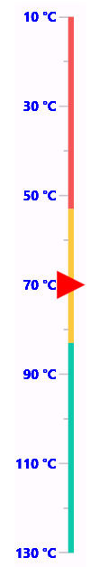

# Getting Started with the .NET MAUI Linear Gauge Control

The [.NET MAUI Linear Gauge](https://www.syncfusion.com/maui-controls/maui-linear-gauge?utm_source=github&utm_medium=listing&utm_campaign=maui-linear-gauge-github-samples) control is a multipurpose data visualization control that displays numerical values on a linear scale either horizontally or vertically. This project shows how to create and configure the Linear Gauge control of Syncfusion. This project also includes a code snippet to set a specific axis pointer value and customize the axis line height and width as well as how to add multiple axis ranges.

## Creating an application using the .NET MAUI Linear Gauge

This guide will help you integrate the Linear Gauge control into your .NET MAUI application.

### Step 1: Create a new .NET MAUI application in Visual Studio

Go to **File > New > Project** and choose the **.NET MAUI App** template.
Name the project and choose a location. Click **Next**.
Select the .NET framework version and click **Create**.

### Step 2: Install the Syncfusion .NET MAUI Linear Gauge NuGet package

In **Solution Explorer**, right-click the project and choose **Manage NuGet Packages**.
Search for `Syncfusion.Maui.Gauges` and install the latest version.
Ensure the necessary dependencies are installed correctly, and the project is restored.

### Step 3: Register the Syncfusion handler

`Syncfusion.Maui.Core` NuGet is a dependent package for all Syncfusion controls of .NET MAUI. In the `MauiProgram.cs` file, register the handler for Syncfusion core.

```csharp
using Syncfusion.Maui.Core.Hosting;

public static class MauiProgram
{
    public static MauiApp CreateMauiApp()
    {
        var builder = MauiApp.CreateBuilder();
        builder
            .UseMauiApp<App>()
            .ConfigureFonts(fonts =>
            {
                fonts.AddFont("OpenSans-Regular.ttf", "OpenSansRegular");
                fonts.AddFont("OpenSans-Semibold.ttf", "OpenSansSemibold");
            });

        // Register Syncfusion core handler
        builder.ConfigureSyncfusionCore();

        return builder.Build();
    }
}
```

### Step 4: Add the Linear Gauge namespace

Import the Gauge namespace to your XAML or C# code.

**XAML**

```xml
xmlns:gauge="clr-namespace:Syncfusion.Maui.Gauges;assembly=Syncfusion.Maui.Gauges"
```

**C#**

```csharp
using Syncfusion.Maui.Gauges;
```

### Step 5: Initialize the Linear Gauge

Initialize the `SfLinearGauge` and configure its axis, ranges, and pointers to display the gauge.

**XAML**

```xml

<gauge:SfLinearGauge Orientation="Vertical" HeightRequest="500" HorizontalOptions="Center"
						Minimum="10" Maximum="130" Interval="20" 
						IsInversed="True" TickPosition="Outside" LabelPosition="Outside"
						LabelFormat="## °C">
	<gauge:SfLinearGauge.LabelStyle>
		<gauge:GaugeLabelStyle TextColor="Blue" FontAttributes="Bold" ></gauge:GaugeLabelStyle>
	</gauge:SfLinearGauge.LabelStyle>
	<gauge:SfLinearGauge.Ranges>
		<gauge:LinearRange StartValue="10" EndValue="53" Fill="#ffF45656" Position="Cross"></gauge:LinearRange>
		<gauge:LinearRange StartValue="53" EndValue="83" Fill="#ffFFC93E" Position="Cross"></gauge:LinearRange>
		<gauge:LinearRange StartValue="83" EndValue="130" Fill="#ff0DC9AB" Position="Cross"></gauge:LinearRange>
	</gauge:SfLinearGauge.Ranges>
	<gauge:SfLinearGauge.MarkerPointers>
		<gauge:LinearShapePointer Value="70" Fill="Red" EnableAnimation="True"
									StepFrequency="8" Position="Cross"
									AnimationEasing="{x:Static Easing.BounceOut}"
									ShapeHeight="25" ShapeWidth="25"></gauge:LinearShapePointer>
	</gauge:SfLinearGauge.MarkerPointers>
	<!--<gauge:SfLinearGauge.LineStyle>
		<gauge:LinearLineStyle Fill="Blue" Thickness="12"></gauge:LinearLineStyle>
	</gauge:SfLinearGauge.LineStyle>-->

</gauge:SfLinearGauge>
```

**C#**

```csharp

SfLinearGauge gauge = new SfLinearGauge
{
    Orientation = LinearGaugeOrientation.Vertical,
    HeightRequest = 500,
    HorizontalOptions = LayoutOptions.Center,
    Minimum = 10,
    Maximum = 130,
    Interval = 20,
    IsInversed = true,
    TickPosition = LinearElementPosition.Outside,
    LabelPosition = LinearLabelPosition.Outside,
    LabelFormat = "## °C",

    LabelStyle = new GaugeLabelStyle
    {
        TextColor = Colors.Blue,
        FontAttributes = FontAttributes.Bold
    }
};

// Ranges
gauge.Ranges.Add(new LinearRange
{
    StartValue = 10,
    EndValue = 53,
    Fill = new SolidColorBrush(Color.FromArgb("#FFF45656")),
    Position = LinearRangePosition.Cross
});

gauge.Ranges.Add(new LinearRange
{
    StartValue = 53,
    EndValue = 83,
    Fill = new SolidColorBrush(Color.FromArgb("#FFFFC93E")),
    Position = LinearRangePosition.Cross
});

gauge.Ranges.Add(new LinearRange
{
    StartValue = 83,
    EndValue = 130,
    Fill = new SolidColorBrush(Color.FromArgb("#FF0DC9AB")),
    Position = LinearRangePosition.Cross
});

// Marker Pointer
gauge.MarkerPointers.Add(new LinearShapePointer
{
    Value = 70,
    Fill = Colors.Red,
    EnableAnimation = true,
    StepFrequency = 8,
    Position = LinearElementPosition.Cross,
    AnimationEasing = Easing.BounceOut,
    ShapeHeight = 25,
    ShapeWidth = 25
});

// Optional Line Style
/*
gauge.LineStyle = new LinearLineStyle
{
    Fill = Colors.Blue,
    Thickness = 12
};
*/


this.Content = linearGauge;
```

[]